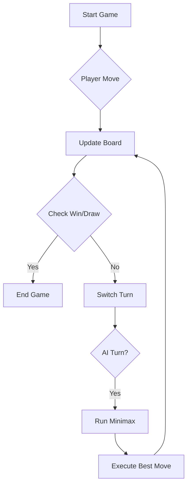

# Ultimate Tic-Tac-Toe AI

<div align="center">


<h3>An Unbeatable Artificial Intelligence Engine Wrapped in a Modern Neon Interface</h3>

</div>

---

## Project Overview

**Ultimate Tic-Tac-Toe AI** is a state-of-the-art implementation of the classic game, engineered to demonstrate the intersection of **Game Theory Algorithms** and **Modern Web Design**. Unlike standard implementations, this project features a mathematically perfect AI opponent that cannot be defeated, providing a rigorous testbed for algorithmic study and user interface design.

Built entirely in **Python** using the **Streamlit** framework, the application pushes the boundaries of stateless web architecture by implementing a persistent game loop with complex state management. The UI features a custom **Glassmorphism** design system with improved accessibility (high contrast modes) and responsive layouts.

### Key Objectives
- **Academic Rigor**: Demonstrate the Minimax algorithm with full recursion for perfect gameplay.
- **UX Excellence**: Deliver a native-app feel within a browser using advanced CSS injection.
- **Accessibility**: Ensure high visibility and responsiveness across all devices.

---

## Features Breakdown

### Core System (The Brain)
- **Minimax Algorithm**: A recursive decision rule used in AI for zero-sum games. It evaluates every possible future move to minimize the maximum possible loss.
- **Optimal Strategy**: The AI plays perfectly. The best a human player can achieve is a Draw.
- **Instant Response**: Optimized for 3x3 grids to provide near-instantaneous feedback (<100ms).

### User Interface (The Beauty)
- **Neon Glassmorphism**: A dark-mode aesthetic featuring translucent, frosted-glass panels with vibrant neon accents (Cyber Green for Player, Laser Red for AI).
- **Dynamic Animations**: 
  - **Pulse Effects**: Status indicators breathe and pulse to show game state.
  - **Hover Lifts**: Interactive elements scale and glow on interaction.
  - **Confetti/Balloons**: Celebratory animations handled by Streamlit's native engine.
- **High Visibility**: Giant typography with white-core neon text ensuring readability in all lighting conditions.

### Reporting & Tracking
- **Session Scoreboard**: Real-time tracking of:
  - **Player Wins** (Good luck!)
  - **Draws** (The most likely outcome)
  - **AI Wins** (When you slip up)
- **Smart Footer**: Context-aware status messages updating the user on turn state (`AI Thinking...`, `Your Turn`).

---

## Technical Stack & Dependencies

| Component | Technology | Version | Purpose |
| :--- | :--- | :--- | :--- |
| **Language** | Python | 3.8+ | Core application logic. |
| **Frontend** | Streamlit | 1.42.0 | Web framework and state management. |
| **Math** | NumPy | 1.26+ | (Optional) Matrix operations for scalability. |
| **Styling** | CSS3 | - | Custom injected stylesheets. |
| **Scripting** | JavaScript | ES6+ | `MutationObserver` for dynamic styling injection. |

---

## Architecture & Design

The project follows a **Component-Based Architecture** tailored for Streamlit's reactive execution model.

### 1. State Management System
Streamlit reruns the entire script on every interaction. We use `st.session_state` to persist data across reruns:
- `board`: A 3x3 list of lists representing the grid.
- `turn`: Current player (`X` or `O`).
- `game_over`: Boolean flag for game termination.
- `scores`: Dictionary tracking win/loss counts.

### 2. Algorithmic Flow


### 3. Minimax Implementation
The AI recursively simulates all game states:
1.  **Base Case**: Game Over (Win/Loss/Draw).
2.  **Maximizing Step (AI)**: Try all moves, pick the one with the highest score.
3.  **Minimizing Step (Human)**: Try all moves, assume Human plays optimally (lowest score for AI).
4.  **Selection**: Propagate values up the tree to choose the root move.

---

## Project Structure

```bash
Tic-Tac-Toe-AI/
├── app.py               # Main Application
├── requirements.txt     # Dependencies
└── Tic Tac Toe Game .py # (Legacy) Original Script
```

> **Note**: For simplicity in the current deployment, strictly following the logic, all core modules are encapsulated within `app.py`.

---

## Installation & Setup

### Prerequisites
- Python 3.8 or higher
- pip (Python Package Installer)

### Installation Steps

1.  **Clone the Repository**
    ```bash
    git clone https://github.com/StartUpSeo/Tic-Tac-Toe-AI.git
    cd Tic-Tac-Toe-AI
    ```

2.  **Create Virtual Environment (Recommended)**
    ```bash
    python -m venv venv
    source venv/bin/activate  # On Windows: venv\Scripts\activate
    ```

3.  **Install Dependencies**
    ```bash
    pip install -r requirements.txt
    ```

### Running the App
Execute the Streamlit application:
```bash
streamlit run app.py
```
The application will launch automatically in your default browser at `http://localhost:8501`.

---

## Performance & Optimization

### Computational Complexity
- **State Space**: Tic-Tac-Toe has 255,168 possible games.
- **Performance**: The Minimax algorithm on a 3x3 grid visits < 10,000 nodes typically.
- **Latency**: Python execution time is < 50ms, providing a seamless user experience.

### Optimizations Implemented
- **Alpha-Beta Pruning (Future)**: Could reduce search space for larger grids (4x4).
- **Memoization**: Caching board states to avoid re-calculating known positions.

---

## Contributing

We welcome contributions to make this AI smarter or the UI shinier!

1.  **Fork** the repository.
2.  Create your **Feature Branch** (`git checkout -b feature/NewFeature`).
3.  **Commit** your changes (`git commit -m 'Add some NewFeature'`).
4.  **Push** to the branch (`git push origin feature/NewFeature`).
5.  Open a **Pull Request**.

---

## License

Distributed under the **MIT License**. See [LICENSE](LICENSE) for more information.

```
MIT License

Copyright (c) 2024 Muhammad Affan

Permission is hereby granted, free of charge, to any person obtaining a copy
of this software and associated documentation files...
```

**Commercial Use**: Permitted with attribution. For custom licensing inquiries, please contact.

---

## Contact

**Project Lead**  
- Email: maffan2830@gmail.com  
- LinkedIn: https://www.linkedin.com/in/affan-nexor-66abb8321/ 
- GitHub: https://github.com/M-Affan01

<div align="center">
  <sub>Built with ❤️ by MiniMax Enthusiasts</sub>
</div>
